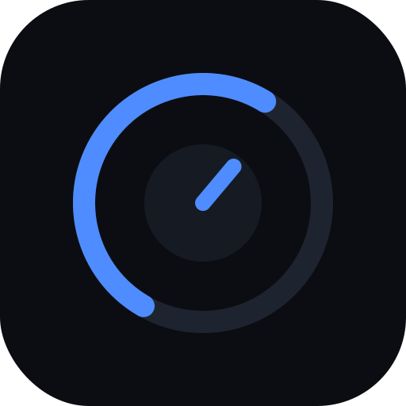

# avm-remote

A self-hosted web remote for the **Anthem AVM90** AV processor, built to be
pleasant to use one-handed on an iPhone (and installable to the home screen as a
PWA). It runs in Docker on your LAN and talks to the receiver over Anthem's
documented IP-control protocol — no dependency on the native app.



## Features

- **Power**, **volume** (slider + fine steps), **mute**
- **Input** selection (sources read live from the receiver)
- **Listening mode** selection
- **Now-playing**: input name, audio format, channel layout, sample rate
- **Live state** pushed over WebSocket — changes from the physical remote, front
  panel, or another client show up instantly
- **PWA**: "Add to Home Screen" for a full-screen, app-like experience

Main zone only (Zone 2 is out of scope for now).

## How it works

```
iPhone Safari (PWA)  ──HTTP / WebSocket──►  FastAPI container  ──TCP :14999──►  AVM90
```

The backend keeps a single persistent connection to the receiver using the
[`anthemav`](https://github.com/nugget/python-anthemav) library, exposes REST
endpoints for commands, and streams state to browsers over a WebSocket.

## Prerequisites

1. **Enable IP control on the AVM90.** On the unit: *Setup → Network/Control*,
   and note its IP address.
2. The machine running Docker must be on the **same network** as the receiver.

> **Note:** The receiver allows only **one** IP-control connection at a time.
> While this app is connected, the native Anthem app and the ARC calibration
> software can't control the unit simultaneously.

## Quick start (Docker)

```sh
# Point it at your receiver's IP and bring it up
ANTHEM_HOST=10.125.200.128 docker compose up -d --build
```

Then open `http://<docker-host-ip>:8000` on your iPhone and add it to the home
screen.

### Configuration

| Variable      | Required | Default | Description                          |
| ------------- | -------- | ------- | ------------------------------------ |
| `ANTHEM_HOST` | yes      | —       | Receiver IP address / hostname       |
| `ANTHEM_PORT` | no       | `14999` | IP-control TCP port                  |
| `LOG_LEVEL`   | no       | `INFO`  | Python log level for the backend     |

## Local development

Requires Python 3.12+.

```sh
python -m venv .venv && source .venv/bin/activate
pip install -r backend/requirements.txt

# Run against the real receiver:
cd backend
ANTHEM_HOST=10.125.200.128 uvicorn app.main:app --reload --port 8000
```

### Without the receiver — mock device

A fake AVM90 that speaks enough of the protocol to drive the whole app:

```sh
# Terminal 1: start the mock on :14999
python scripts/mock_avm.py

# Terminal 2: run the app against it
cd backend
ANTHEM_HOST=127.0.0.1 uvicorn app.main:app --reload --port 8000
```

### Verify the protocol against your unit

Before trusting the app, confirm the library actually talks to your AVM90:

```sh
python scripts/probe.py 10.125.200.128          # one-shot state dump
python scripts/probe.py 10.125.200.128 --watch  # stream live changes
```

## API

| Method | Path          | Body                                   |
| ------ | ------------- | -------------------------------------- |
| GET    | `/health`     | —                                      |
| GET    | `/api/state`  | —                                      |
| POST   | `/api/power`  | `{"on": true}`                         |
| POST   | `/api/volume` | `{"level": 35}` or `{"step": -2}`      |
| POST   | `/api/mute`   | `{}` (toggle) or `{"on": true}`        |
| POST   | `/api/input`  | `{"number": 3}`                        |
| POST   | `/api/mode`   | `{"mode": "Dolby Surround"}`           |
| WS     | `/ws`         | receives `ReceiverState` JSON on change |

Command endpoints return the immediate (pre-change) snapshot; the authoritative
post-change state always arrives over the WebSocket a moment later.

## Troubleshooting

**Flaky connection / status that goes stale or "sometimes works":**

1. **Enable Standby IP Control on the receiver.** *Setup → Network* (or
   *General → Standby IP Control* depending on firmware). If this is **off**, the
   AVM90 drops off the network when powered down and won't answer IP control,
   which looks exactly like an intermittent connection. Turn it **on**.
2. **Close the native Anthem app / ARC software.** The receiver accepts only
   **one** IP-control connection at a time; another client will fight this one.
3. The backend already self-heals dropped links: it enables TCP keepalive, sends
   a liveness probe every ~10s, forces a reconnect if the link goes silent for
   30s, and resyncs full state every ~60s. After a network blip or a receiver
   power-cycle the UI should recover on its own within a few seconds.

Confirm what the receiver is actually doing with the probe — leave it running and
watch the link:

```sh
python scripts/probe.py 10.125.200.128 --watch
```

## Notes

- The AVM90 is an "x40"-series device: volume is a 0–100 percentage and listening
  modes use the x40 table. The backend works around a quirk in `anthemav` where
  the *current* listening-mode name would otherwise be decoded with the wrong
  (x20) table.
- This app assumes a trusted home LAN: there's no authentication and it should
  not be exposed directly to the internet.
